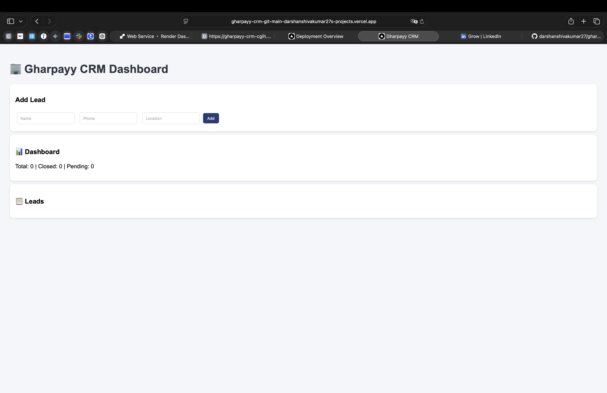

# 🚀 Gharpayy CRM – Lead Management System

A clean, scalable **Lead Management CRM (MVP)** built as part of the Gharpayy AI Internship assignment.
This system is designed to handle real-world workflows including lead tracking, assignment, and pipeline management.

---

## 🌐 Live Links

- 🔗 **Live Application**: https://YOUR-VERCEL-LINK
- 🔗 **Backend API**: https://gharpayy-crm-cglh.onrender.com
- 🔗 **API Documentation**: https://gharpayy-crm-cglh.onrender.com/docs

---

## 📸 Project Preview



---

## ✨ Features

- 📌 **Lead Creation**
  Add and manage leads with name, phone, and location

- 🔄 **Status Tracking Pipeline**
  Manage lead lifecycle (New → Closed)

- 👤 **Agent Assignment**
  Assign leads to agents dynamically

- 📅 **Visit Scheduling Support**
  Extendable structure for scheduling visits

- 📊 **Dashboard Analytics**
  View total, closed, and pending leads

- ⚡ **RESTful API Architecture**
  Clean and modular FastAPI backend

- 🌐 **Full Deployment**
  Backend deployed on Render, frontend on Vercel

---

## 🛠️ Tech Stack

- **Backend**: FastAPI, SQLAlchemy
- **Database**: SQLite
- **Frontend**: HTML, CSS, JavaScript
- **Deployment**: Render (Backend), Vercel (Frontend)

---

## 🧩 Project Structure

```
gharpayy-crm/
│── app/
│   ├── main.py
│   ├── models.py
│   ├── schemas.py
│   ├── crud.py
│   ├── database.py
│   ├── routes/
│
│── frontend/
│   ├── index.html
│
│── screenshots/
│   ├── dashboard.png
│
│── requirements.txt
│── README.md
```

---

## ⚙️ Run Locally

```bash
git clone https://github.com/YOUR_USERNAME/gharpayy-crm.git
cd gharpayy-crm

python3 -m venv venv
source venv/bin/activate

pip install -r requirements.txt

uvicorn app.main:app --reload
```

Open in browser:

- http://127.0.0.1:8000/docs

---

## 🧠 Design Approach

- Built as a **Minimum Viable Product (MVP)** with real-world usability
- Focused on **clean architecture and modular design**
- Ensured **scalability for future enhancements**
- Designed to simulate a **production-ready CRM workflow**

---

## 🚀 Key Highlights

- Fully functional end-to-end system
- Deployed and accessible online
- Structured backend with clear separation of concerns
- Lightweight and efficient implementation
- Completed within a **48-hour product build constraint**

---

## 👨‍💻 Author

**Darshan S**
BE Computer Science & Data Science
PES College of Engineering, Mandya

---

## 📌 Note

This project was developed as part of an internship selection process to demonstrate practical skills in backend development, system design, and product thinking.
